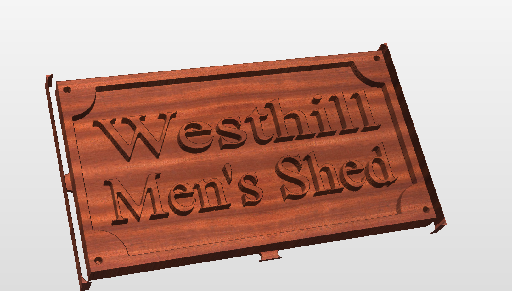

# Westhill Men's Shed Sign

This repository is used to retain and share the project files for my very first CNC project. I have access to a CNC machine at my men's shed. I am a member of the [Westhill Men's Shed](https://westhillmensshed.co.uk/) and I have started to try and learn how to use our Genmitsu 6050 XL CNC.

As a result of this oppourtunity, I felt that my very first project should be a gift to my Mens Shed. So I used [this tutorial](https://youtu.be/ooTRI9rHydw?si=Rx-USfFQcL9nOxGO) from the Vectric youtube channel as the inspiration to make the sign.

Using the tutorial I was able to make my own for the Westhill Men's Shed

# 

# Project File

## CNC Software

This project file was built using Vectric VCarve Pro v12.011

## Endmills

This project is based on the following endmills:

1. TBD

2. TBD

 
